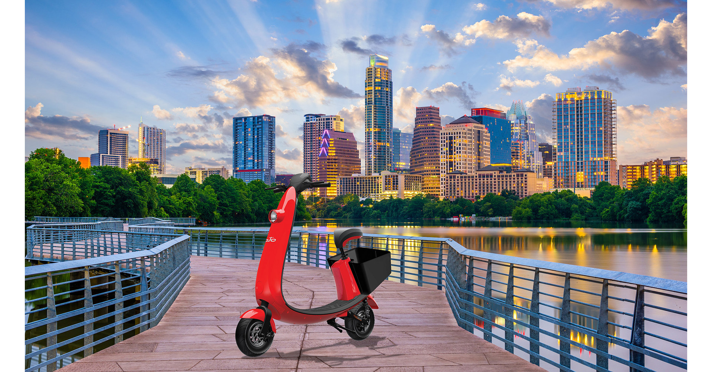

## What does COVID-19 mean for shared mobility in Austin, Texas?

### Austin Scooter Rides - Pre Vs Post Pandemic
Since March 2020, the novel coronavirus has brought the shared scooter and bike business to the brink of financial collapse. My objective is to analyze how did the city's lockdown affect the thriving scooter and bike scene in Austin, TX.

### Data Source:
Austin Shared Mobility API: 
https://data.austintexas.gov/Transportation-and-Mobility/Shared-Micromobility-Vehicle-Trips/7d8e-dm7r

### Technologies Used:

- Pandas 
- NumPy
- Matplotlib 
- GeoPandas
- Plotly.js
- SQLAlchemy

